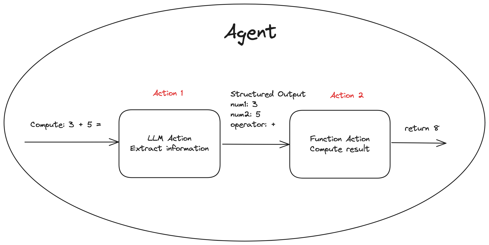
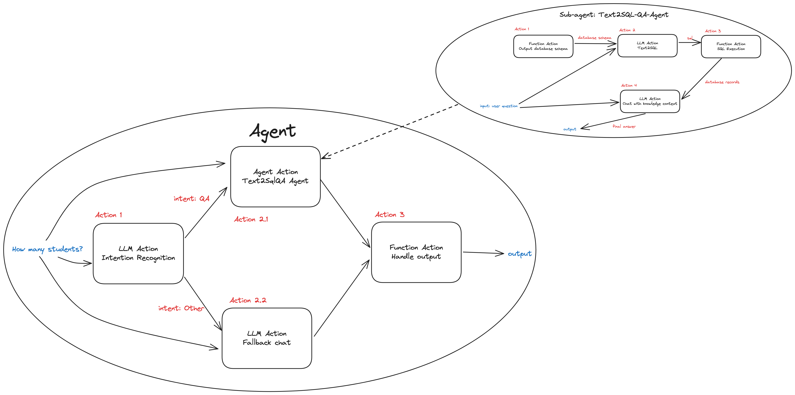

FlexiAgent
----------

FlexiAgent is a simple and easy-to-use framework for creating LLM agents. The agent supports structured output and includes built-in practical agents such as a text2sql agent, allowing for quick deployment in applications.


Features
--------

- **Efficient and Simple Agent Interface Design**: Supports structured output, making it easier to utilize in practical applications.

- **DAG-Based Task Implementation**: The agent's tasks are built on DAGs, supporting distributed concurrent scheduling.

- **Configuration-Driven Agent Creation**: Offers high flexibility and extensibility through comprehensive configuration support.

- **Built-In Practical Agents**: Includes useful agents like `text2sql`, `llm_chat`, and `api_call` for fast deployment and reduced development time.


Installation
------------

To begin using FlexiAgent, you can install from pypi
```shell
pip install flexiagent
```

Or clone the repository from GitHub:
```shell
git clone https://github.com/dzhsurf/flexiagent.git
cd flexiagent
pip install -e .
# or use poetry
# poetry install
```

Ensure you have Python installed and set up a virtual environment(conda recommended):
```shell
# python3.11 recommended, support python3.8+
conda create -n proj python=3.11 
```

If you encounter issues compiling llama-cpp-python during the dependency installation process, please visit https://github.com/abetlen/llama-cpp-python for documentation to help resolve the issue.


Usage
-----

Before using FlexiAgent, you'll need to set up your `OPENAI_API_KEY`. You can set this environment variable in your system or include it in your code:

```shell
export OPENAI_API_KEY='your-api-key-here' 
```

FlexiAgent can be easily integrated into your existing projects. Below is a basic setup to get you started:




```python
from flexiagent.llm.config import LLMConfig
from flexiagent.task.task_node import (
    FxTaskAction,
    FxTaskActionLLM,
    FxTaskAgent,
    FxTaskConfig,
    FxTaskEntity,
)

llm_config = LLMConfig(engine="OpenAI", params={"openai_model": "gpt-4o-mini"})

class Step1Output(FxTaskEntity):
    num1: float 
    num2: float 
    op: str 

class Step2Output(FxTaskEntity):
    result: float

def compute_nums(input: Dict[str, Any], addition: Dict[str, Any]) -> Step2Output:
    nums: Step1Output = input["step_1"]
    result = 0.0
    if nums.op == "+":
        result = nums.num1 + nums.num2
    elif nums.op == "-":
        result = nums.num1 - nums.num2
    elif nums.op == "*":
        result = nums.num1 * nums.num2
    elif nums.op == "/":
        result = nums.num1 / nums.num2
    else:
        result = 0
    return Step2Output(
        result=result,
    )

agent = FxTaskAgent(
    task_graph=[
        # step 1: llm extract data
        FxTaskConfig(
            task_key="step_1",
            input_schema={"input": str},
            output_schema=Step1Output,
            action=FxTaskAction(
                type="llm",
                act=FxTaskActionLLM(
                    llm_config=llm_config,
                    instruction="""
Extract the numbers and operators from mathematical expressions based on the user's questions. 
Only support +, -, *, / operations with two numbers.

Question: {input}
""",
                ),
            ),
        ),
        # step 2: compute
        FxTaskConfig(
            task_key="output",
            input_schema={"step_1": Step1Output},
            output_schema=Step2Output,
            action=FxTaskAction(
                type="function",
                act=compute_nums,
            ),
        ),
    ],
)

output = agent.invoke("Compute: 3 + 5 =")
# output is Step2Output, result is 8
```


**Text2SqlQA Agent**



For the complete code, please check it out here: https://github.com/dzhsurf/flexiagent/blob/master/examples/gradio_chatbot/text2sql_qa_chatbot.py

```python
chatbot_agent = FxTaskAgent(
  task_graph=[
    # step 1: analyze user intent
    FxTaskConfig(
      task_key="user_intent",
      input_schema={"input": ChatBotInput},
      output_schema=UserIntent,
      action=FxTaskAction(
        type="llm",
        act=FxTaskActionLLM(
          llm_config=llm_config,
          instruction="""Based on the user's question, analyze the user's intent. The classification is as follows:
- QA: If the question is about student information, grades, class information, etc.
- Other: Otherwise, it falls under this category.

{input.history_as_text}

Question: {input.input}
""",
        ),
      ),
    ),
    # step 2.1: text2sql qa action
    FxTaskConfig(
      task_key="text2sql_qa",
      input_schema={
        "input": ChatBotInput,
        "user_intent": UserIntent,
      },
      output_schema=str,
      action=FxTaskAction(
        type="agent",
        act=create_text2sql_qa_agent(
          llm_config,
          _fetch_database_metainfo,
          preprocess_hook=_convert_chatbot_input_to_text2sql_qa_input,
        ),
        condition=_condition_text2sql_qa,
      ),
    ),
    # step 2.2: fallback action
    FxTaskConfig(
      task_key="fallback_action",
      input_schema={
        "input": ChatBotInput,
        "user_intent": UserIntent,
      },
      output_schema=str,
      action=FxTaskAction(
        type="llm",
        act=FxTaskActionLLM(
          llm_config=llm_config,
          instruction="""You are a chatbot assistant. Assist user and response user's question.

{input.history_as_text}

Question: {input.input}
""",
        ),
        condition=_condition_fallback_action,
      ),
    ),
    # step 3:
    FxTaskConfig(
      task_key="output",
      input_schema={
        "user_intent": UserIntent,
        "text2sql_qa": str,
        "fallback_action": str,
      },
      output_schema=ChatBotResponse,
      action=FxTaskAction(
        type="function",
        act=_generate_output,
      ),
    ),
  ]
)
```


Quickstart
----------

To get started quickly with FlexiAgent, please refer to the [Quickstart](https://github.com/dzhsurf/flexiagent/blob/master/Quickstart.md) Guide for example usage.


Using Local Deployment Model (Llama.cpp)
----------------------------------------

FlexiAgent utilizes llama-cpp-python, allowing the LLM to support not only OpenAI but also Llama.cpp. 
The above code example can load a local model using Llama.cpp by changing the configuration.

**Parameter Explanation**

**repo_id_or_model_path:** 
If specified as a repo_id, the model will be downloaded to the cache directory `(~/.cache/huggingface/...)` using huggingface-cli. If it is a local model path (e.g., xxx_model.gguf), it will be loaded directly.

**repo_filename:** 
This is only effective when `repo_id_or_model_path` is a repo_id. It selects the specified model based on the filename rules, such as Q4_K_M, Q8_0, etc., and should be set according to the file names in the huggingface repo.

**n_ctx:** Context window size; defaults to 512 if not set.

```python
llm_config = LLMConfig(
    engine="LlamaCpp",
    params={
        "repo_id_or_model_path": "QuantFactory/Llama-3.2-3B-Instruct-GGUF",
        "repo_filename": "*Q4_K_M.gguf",
        "n_ctx": 4096,
    },
)
````


Contributing
------------

Contributions are welcome! Please fork the repository and use a branch for your feature or bug fix. Submitting a pull request is the best way to see your feature merged.


License
-------

This project is licensed under the MIT License - see the LICENSE file for details.