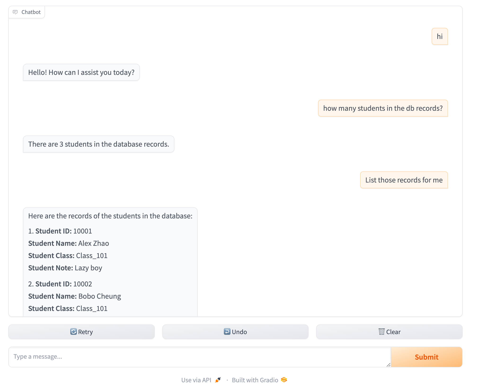

# Examples

Currently, there are the following examples:
- gradio-simple-chatbot: A simple ChatBot built with Gradio.
- gradio-text2sql-qa-chatbot: A QA ChatBot with Text2SQL.


**Installation and Usage**

```shell
pip install -r requirements.txt
```

Input parameters based on the example you want to run:

```shell
python main.py EXAMPLE=gradio-simple-chatbot
```


**Screenshot**

- gradio-simple-chatbot


- gradio-text2sql-qa-chatbot

  

  